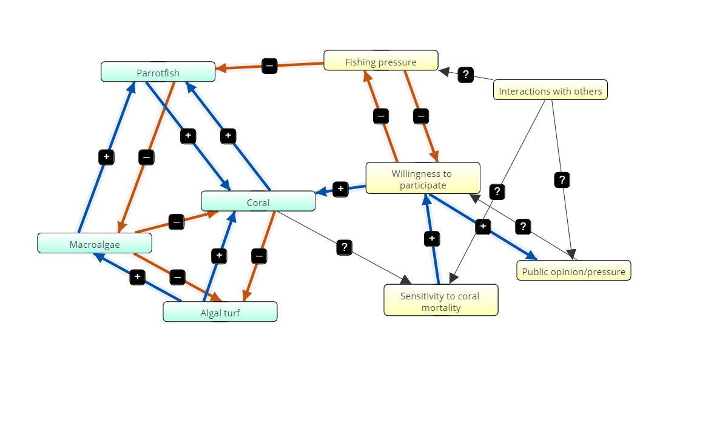

**Part A**
**Our Consensus Flow Diagram**

```{r echo=FALSE}

knitr::include_graphics('model-coral_0.png')

```
**#3**
**Flow diagram for coral reef system**

```{r echo=FALSE}
knitr::include_graphics('model-coral.png')
```

In this flow diagram, macroalgae grows on top of coral, which is a negative effect for the coral. Coral grows on algal turf, which negatively effects the algal turf. Parrotfish eat the macroalgae, negatively effecting macroalgae. Macroalgae can grow over algal turf, which negatively impacts the algal turf. Parrotfish have an indirect positive effect on coral by eating the algae smothering the coral, and coral has an indirect positive effect on parrotfish by providing a substrate for macroalgae, which parrotfish eat, to grow on. 

```{r echo=FALSE}
read.csv("coral_variables.csv")
```

**# 4: Program the Model**  
  
```{r} 

require(deSolve)
## Loading required package: deSolve

coral_state <- c(C = .9, M = .05, T = .05, P = .4) ## Initial starting states; state should add up to 1 (disregard parrotfish)
times <- seq(0,100, by = 0.1)

# Parameters
coral_parameters <- c(a = 0.1,g = 0.8, d = 0.44,r = 1, s = 0.49) ### parameters stay constant


# Model
coral <- function(t,coral_state,coral_parameters){
  with(as.list(c(coral_state,coral_parameters)),{
       dC <- (r*T*C) - (d*C) - (a*M*C)
       dT <- (P*M/(M+T) - (g*M*T) - (r*T*C) + (d*C))
       dM <- ((a*M*C) - ((P*M)/(M+T)) + (g*M*T))
       dP <- (s*P)*(1- (P/(C)))
      list(c(dC, dT, dM, dP))   
  })}

# Solve model and plot results
out1 <- ode(y = coral_state, times=times, func=coral, parms=coral_parameters)
par(mfrow=c(2,2))
coralplot <- plot(out1[,1],out1[,2],ylab='Coral',xlab='time',las=1, pch = 19)
coralplot <- plot(out1[,1],out1[,3],ylab='Algal Turf',xlab='time',las=1, pch = 19)
coralplot <- plot(out1[,1],out1[,4],ylab='Macroalgae',xlab='time',las=1, pch = 19)
coralplot <- plot(out1[,1],out1[,5],ylab='Parrotfish',xlab='time',las=1, pch = 19)
#how do we get the y-axis of algal turf and macroalgae to be positive and b/n 0 & 1
#why do these graphs look nothing like the one below using Easton's code?
```

```{r}

#alternative way to program the ecological model - via Easton's code 
require(deSolve)
coupled_model <- function(Time, State, Pars) {
  with(as.list(c(State, Pars)), {
    dM <-  a*M*C - (P*M)/(M+T) + gamma*M*T
    dC <-  r*T*C - d*C - a*M*C
    dT <- (P*M)/(M+T) - gamma*M*T - r*T*C + d*C
    dP <- s*P*(1 - P/C)
    return(list(c(dM,dC,dT,dP)))  
  })
}

pars <- c(a = 0.1, gamma = 0.8, r = 1.0, d = 0.44, s = 0.49, sigma = 0.5)


yini  <- c(M = 0.05, C = 0.9, T = 0.05, P = 0.4)
times <- seq(0, 100, by = 0.1)
out   <- ode(yini, times, coupled_model, pars)

par(mfrow=c(1,2))
matplot(out[ , 1], out[ , 2:5], type = "l", xlab = "time", ylab = "Percent cover",main = "Ecological dynamics",
        lwd = 2,ylim=c(0,1))
legend('topright',legend = c('macroalgae','coral reef','turf algae','parrotfish'),col = c(1,2,3,4),pch = 18)

#these outputs are much nicer

```

**#5**
#Produce figures and design analyses to address the following questions: 
**(a) What are the long-term dynamics of the system with the default parameters given below?**
  - The long term dynamics are dependent upon the initial population sizes of macroalgae, algal turf, parrotfish, and coral. If initial percent cover of coral is high, coral and parrot fish converge just shy of 60% cover, turf increases to just over 40%, and macroalgae dies out quickly. 


**(b) What are the most important parameters in determining the long-term dynamics?**
  - Coral is one of the most important parameters in determining the long-term dynamics; based on the equations, it influences the growth of every other organism in the system. Additionally, Parrotfish play an important role in controlling the macroalgae.  


``` {r}
### Below, I am trying to make For loops to test our models at different parameters. This first one shows how parrotfish population changes in response to coral population changes.

x <- seq(0,1, by = 0.1) ### variable that changes, in this case, coral.

## Below parameters do not change
s <- as.numeric(s <- 0.49)
a <- as.numeric(a <- 0.1)
g <- as.numeric(g <- 0.8)
d <- as.numeric(d <- 0.44)
r <- as.numeric(r <- 1)

## Below parameters can be changed
M <- as.numeric(M <- 0.5)
C <- as.numeric(C <- 0.5)
P <- as.numeric(P <- 0.5)
R <- as.numeric(R <- 0.8)

## Creating the function

parrot <- function(pop){
       dP <- (s*P)*(1- (P/(x)))
      list(c(dP))   
  }

### The below for loop explores the parrotfish population 

parrotpop <- c()
for( i in x){
  parrotpop <- parrot(i)
}
print(parrotpop)
 

x <- as.data.frame(x)
parrotpop <- as.data.frame(parrotpop)

parrot_plot <- cbind(x, parrotpop)
plot(parrot_plot, xlab = 'Coral', ylab = 'Parrotfish')  ## as coral increases, so does parrotfish populations


```

```{r}

### For loop for coral populations. You can change the variables by substituting x in for R, C, or M. Note - if you make substitution make sure you also change the name of the x-axis.

x <- seq(0,1, by = 0.1) ### variable that changes, in this case.

## Below parameters do not change
s <- as.numeric(s <- 0.49)
a <- as.numeric(a <- 0.1)
g <- as.numeric(g <- 0.8)
d <- as.numeric(d <- 0.44)

## Below parameters can be changed
M <- as.numeric(M <- 0.5)
C <- as.numeric(C <- 0.5)
P <- as.numeric(P <- 0.5)
R <- as.numeric(R <- 0.8)


# Creating the function
coral <- function(pop){
       dC <- (r*x*C) - (d*C) - (a*M*C)
      list(c(dC))   
  }

# Creating the loop
coralpop <- c()
for( i in x){
  coralpop <- coral(i)
}
print(coralpop)
 
# Making the plot
x <- as.data.frame(x)
coralpop <- as.data.frame(coralpop)

coral_plot <- cbind(x, coralpop)
plot(coral_plot, xlab = 'Algal Turf', ylab = 'Coral')

```

```{r}

### For loop for algal turf populations. You can change the variables by substituting x in for R, C, or M. Note - if you make substitution make sure you also change the name of the x-axis.

x <- seq(0,1, by = 0.1) ### variable that changes, in this case.

## Below parameters do not change
s <- as.numeric(s <- 0.49)
a <- as.numeric(a <- 0.1)
g <- as.numeric(g <- 0.8)
d <- as.numeric(d <- 0.44)
r <- as.numeric(r <- 1)

## Below parameters can be changed
M <- as.numeric(M <- 0.5)
C <- as.numeric(C <- 0.5)
P <- as.numeric(P <- 0.5)
R <- as.numeric(R <- 0.8)


# Creating the function
turf <- function(pop){
       dT <- (x*M/(M+R) - (g*M*R) - (r*R*C) + (d*C))
      list(c(dT))  
  }

# Creating the loop
turfpop <- c()
for( i in x){
  turfpop <- turf(i)
}
print(turfpop)
 
# Making the plot
x <- as.data.frame(x)
turfpop <- as.data.frame(turfpop)

turf_plot <- cbind(x, turfpop)
plot(turf_plot, xlab = 'Parrotfish', ylab = 'Algal Turf')

```

```{r}

### For loop for macroalgae populations. You can change the variables by substituting x in for R, C, or M. Note - if you make substitution make sure you also change the name of the x-axis.

x <- seq(0,1, by = 0.1) ### variable that changes, in this case.

## Below parameters do not change
s <- as.numeric(s <- 0.49)
a <- as.numeric(a <- 0.1)
g <- as.numeric(g <- 0.8)
d <- as.numeric(d <- 0.44)
r <- as.numeric(r <- 1)

## Below parameters can be changed
M <- as.numeric(M <- 0.5)
C <- as.numeric(C <- 0.5)
P <- as.numeric(P <- 0.5)
R <- as.numeric(R <- 0.5)


# Creating the function
macro <- function(pop){
       dM <- ((a*M*x) - ((P*M)/(M+R)) + (g*M*R))
      list(c(dM)) 
  }

# Creating the loop
macropop <- c()
for( i in x){
  macropop <- macro(i)
}
print(macropop)
 
# Making the plot
x <- as.data.frame(x)
macropop <- as.data.frame(macropop)

macro_plot <- cbind(x, turfpop)
plot(turf_plot, xlab = 'Coral', ylab = 'Macroalgae')

```

Now combining all the organisms into 1 figure, and then changing the initial percent covers to see how the model reacts 

```{r}

require(deSolve)
coupled_model <- function(Time, State, Pars) {
  with(as.list(c(State, Pars)), {
    dM <-  a*M*C - (P*M)/(M+T) + gamma*M*T
    dC <-  r*T*C - d*C - a*M*C
    dT <- (P*M)/(M+T) - gamma*M*T - r*T*C + d*C
    dP <- s*P*(1 - P/C)
    return(list(c(dM,dC,dT,dP)))  
  })
}

pars <- c(a = 0.1, gamma = 0.8, r = 1.0, d = 0.44, s = 0.49, sigma = 0.5)

#First, I'll try lowering initial coral, and raising macroalgae and algal turf
yini  <- c(M = 0.45, C = 0.1, T = 0.45, P = 0.4)
times <- seq(0, 100, by = 0.1)
out   <- ode(yini, times, coupled_model, pars)

par(mfrow=c(1,2))
matplot(out[ , 1], out[ , 2:5], type = "l", xlab = "time", ylab = "Percent cover",main = "Ecological dynamics",
        lwd = 2,ylim=c(0,1))
legend('topright',legend = c('macroalgae','coral reef','turf algae','parrotfish'),col = c(1,2,3,4),pch = 18)

```
A dramtically lower initial coral and a higher initial macroalgae and algal turf results in everything but macroalgae going to extinction  
```{r}

require(deSolve)
coupled_model <- function(Time, State, Pars) {
  with(as.list(c(State, Pars)), {
    dM <-  a*M*C - (P*M)/(M+T) + gamma*M*T
    dC <-  r*T*C - d*C - a*M*C
    dT <- (P*M)/(M+T) - gamma*M*T - r*T*C + d*C
    dP <- s*P*(1 - P/C)
    return(list(c(dM,dC,dT,dP)))  
  })
}

pars <- c(a = 0.1, gamma = 0.8, r = 1.0, d = 0.44, s = 0.49, sigma = 0.5)

#Now, I'll try lowering initial parrotfish, and keeping the other parameters the same as the default
yini  <- c(M = 0.05, C = 0.9, T = 0.05, P = .001)
times <- seq(0, 100, by = 0.1)
out   <- ode(yini, times, coupled_model, pars)

par(mfrow=c(1,2))
matplot(out[ , 1], out[ , 2:5], type = "l", xlab = "time", ylab = "Percent cover",main = "Ecological dynamics",
        lwd = 2,ylim=c(0,1))
legend('topright',legend = c('macroalgae','coral reef','turf algae','parrotfish'),col = c(1,2,3,4),pch = 18)

```
Initial parrotfish cover definitely infuences the long term dynamics of the whole system. If initial parrotfish cover is very small, it leads to macroalgae dominating the system and driving the other organisms to extinction   

```{r}

require(deSolve)
coupled_model <- function(Time, State, Pars) {
  with(as.list(c(State, Pars)), {
    dM <-  a*M*C - (P*M)/(M+T) + gamma*M*T
    dC <-  r*T*C - d*C - a*M*C
    dT <- (P*M)/(M+T) - gamma*M*T - r*T*C + d*C
    dP <- s*P*(1 - P/C)
    return(list(c(dM,dC,dT,dP)))  
  })
}

pars <- c(a = 0.1, gamma = 0.8, r = 1.0, d = 0.44, s = 0.49, sigma = 0.5)

#Now, I'll try raising initial algal turf, and inversely lowering coral
yini  <- c(M = 0.05, C = 0.1, T = 0.85, P = .4)
times <- seq(0, 100, by = 0.1)
out   <- ode(yini, times, coupled_model, pars)

par(mfrow=c(1,2))
matplot(out[ , 1], out[ , 2:5], type = "l", xlab = "time", ylab = "Percent cover",main = "Ecological dynamics",
        lwd = 2,ylim=c(0,1))
legend('topright',legend = c('macroalgae','coral reef','turf algae','parrotfish'),col = c(1,2,3,4),pch = 18)

```
Algal turf doesn't seem to have as dramatic an effect on the long term system dynamics. The system wobbles for about 20 years, but then still converges to the same percent covers as with the default parameters. 

**7**  
**Consensus Flow Diagram**  
```{r echo=FALSE}

```

**8**  
As a group, we decided that coral, willingness to participate and the parrotfish/macroalgae dynamic are the most important parameters for determining overal system dynamics.  
We predit that with the default parameters, everything will likely go extinct with the exception of macroalgae, just as it did before the social element was involved. 

**9**
Programming the model  

```{r}
#Easton's code
require(deSolve)
coupled_model <- function(Time, State, Pars) {
  with(as.list(c(State, Pars)), {
    dM <-  a*M*C - (P*M)/(M+T) + gamma*M*T
    dC <-  r*T*C - d*C - a*M*C
    dT <- (P*M)/(M+T) - gamma*M*T - r*T*C + d*C
    dP <- s*P*(1 - P/C) - sigma*P*(1 - X)
    dX <- kappa*X*(1 - X)*(-1 + j*(1 - C) - sigma*P*(1 - X) + phi*(2*X - 1))
    return(list(c(dM,dC,dT,dP,dX)))  
  })
}

pars <- c(a = 0.1, gamma = 0.8, r = 1.0, d = 0.44, s = 0.49, sigma = 0.5, kappa= 1.014, j=1.68, 
          sigma = 0.5, phi = 0.2)


yini  <- c(M = 0.05, C = 0.9, T = 0.05, P = 0.4, X = 0.5)
times <- seq(0, 100, by = 0.1)
out   <- ode(yini, times, coupled_model, pars)

par(mfrow=c(1,2))
matplot(out[ , 1], out[ , 2:5], type = "l", xlab = "time", ylab = "Percent cover",main = "Ecological dynamics",
        lwd = 2,ylim=c(0,1))
legend('topright',legend = c('macroalgae','coral reef','turf algae','parrotfish'),col = c(1,2,3,4),pch = 18)

matplot(out[ , 1], out[ , 6], type = "l", xlab = "time", ylab = "Fraction that are conservationists",
        main = "Conservation opinion", lwd = 2,ylim=c(0,1),col=5)

```

**10**  
(a) What are the long-term dynamics of the system with the default parameters?  
With the default parameters, the coral reef will die. Macroalgae cover increases to 100% and the other organisms decrease to extinction. The fraction of conservationists initially dips to zero for the first 50 years, but once the coral go extinct, then people start to care again. Unfortunately, in our model, it's too late. 

(b) What are the most important parameters in determining the long-term dynamics?  
To answer this question, I will manipulate the initial fractional value for the social input to the model and see how it effects the long-term dynamics. The "X", or willingness to participate, is the only new input to the system, so since I've already explored long-term dynamics of the ecological inputs, I only need to experiment with the willingness to participate input to understand how the entire system will respond. 

```{r}
require(deSolve)
coupled_model <- function(Time, State, Pars) {
  with(as.list(c(State, Pars)), {
    dM <-  a*M*C - (P*M)/(M+T) + gamma*M*T
    dC <-  r*T*C - d*C - a*M*C
    dT <- (P*M)/(M+T) - gamma*M*T - r*T*C + d*C
    dP <- s*P*(1 - P/C) - sigma*P*(1 - X)
    dX <- kappa*X*(1 - X)*(-1 + j*(1 - C) - sigma*P*(1 - X) + phi*(2*X - 1))
    return(list(c(dM,dC,dT,dP,dX)))  
  })
}

pars <- c(a = 0.1, gamma = 0.8, r = 1.0, d = 0.44, s = 0.49, sigma = 0.5, kappa= 1.014, j=1.68, 
          sigma = 0.5, phi = 0.2)

#First, I'll try increasing the fraction of individuals willing to participate in coral conservation
yini  <- c(M = 0.05, C = 0.9, T = 0.05, P = 0.4, X = .9)
times <- seq(0, 100, by = 0.1)
out   <- ode(yini, times, coupled_model, pars)

par(mfrow=c(1,2))
matplot(out[ , 1], out[ , 2:5], type = "l", xlab = "time", ylab = "Percent cover",main = "Ecological dynamics",
        lwd = 2,ylim=c(0,1))
legend('topright',legend = c('macroalgae','coral reef','turf algae','parrotfish'),col = c(1,2,3,4),pch = 18)

matplot(out[ , 1], out[ , 6], type = "l", xlab = "time", ylab = "Fraction that are conservationists",
        main = "Conservation opinion", lwd = 2,ylim=c(0,1),col=5)

```
Increasing willingness to participate delayed the inevitable, but didn't change the overall outcome  


```{r}
require(deSolve)
coupled_model <- function(Time, State, Pars) {
  with(as.list(c(State, Pars)), {
    dM <-  a*M*C - (P*M)/(M+T) + gamma*M*T
    dC <-  r*T*C - d*C - a*M*C
    dT <- (P*M)/(M+T) - gamma*M*T - r*T*C + d*C
    dP <- s*P*(1 - P/C) - sigma*P*(1 - X)
    dX <- kappa*X*(1 - X)*(-1 + j*(1 - C) - sigma*P*(1 - X) + phi*(2*X - 1))
    return(list(c(dM,dC,dT,dP,dX)))  
  })
}

pars <- c(a = 0.1, gamma = 0.8, r = 1.0, d = 0.44, s = 0.49, sigma = 0.5, kappa= 1.014, j=1.68, 
          sigma = 0.5, phi = 0.2)

#But what if 100% of people were willing to participate in conservation?
yini  <- c(M = 0.05, C = 0.9, T = 0.05, P = 0.4, X = 1)
times <- seq(0, 100, by = 0.1)
out   <- ode(yini, times, coupled_model, pars)

par(mfrow=c(1,2))
matplot(out[ , 1], out[ , 2:5], type = "l", xlab = "time", ylab = "Percent cover",main = "Ecological dynamics",
        lwd = 2,ylim=c(0,1))
legend('topright',legend = c('macroalgae','coral reef','turf algae','parrotfish'),col = c(1,2,3,4),pch = 18)

matplot(out[ , 1], out[ , 6], type = "l", xlab = "time", ylab = "Fraction that are conservationists",
        main = "Conservation opinion", lwd = 2,ylim=c(0,1),col=5)

```
Aha, so with full conservation participation, the coral system is able to survive.  

**11**  
How did your predictions about the coupled socio-ecological systems line up with the results from the model? How did your results line up with the original modeling paper?  

My synical instincts served me well, and my predictions of the coupled socio-ecological model were supported by the model. The coral were doomed to extinction from the start. 


**12**  
How did your flow diagrams change over the course of the lessons? What did you learn through the process of developing flow diagrams with others?  

The flow diagram become more complex over the course of the lesson, and I learned that modelling complex systems with many moving parts is difficult to simplify into a flow diagram. I have doubts that our flow diagram is an accurate depiction of reality.    

**13**  
What were the limitations of the coupled socio-ecological model used here? What changes would you make to the model?  

Of course, any model has limitations. I think there are more parameters impacting the coral system. From an ecological perspective, including climate change/rising ocean temperatures, white band disease, hurricanes, snail/worm populations, sea urchin population, and nutrient concentration in the model would push the model closer to the actual reality of the ecosystem. Additionally, from the social side of the model, including government regulations on pollution flowing into the ocean would certainly have an impact on the end result.


**14**  
What aspects of this assignment were most or least useful? How would you improve this assignment?  

It was very helpful to get feedback on the code between parts A & B. I think it would improve the assignment to know how well our model compares to reality. Is there empirical data from a Carribean coral reef system?


