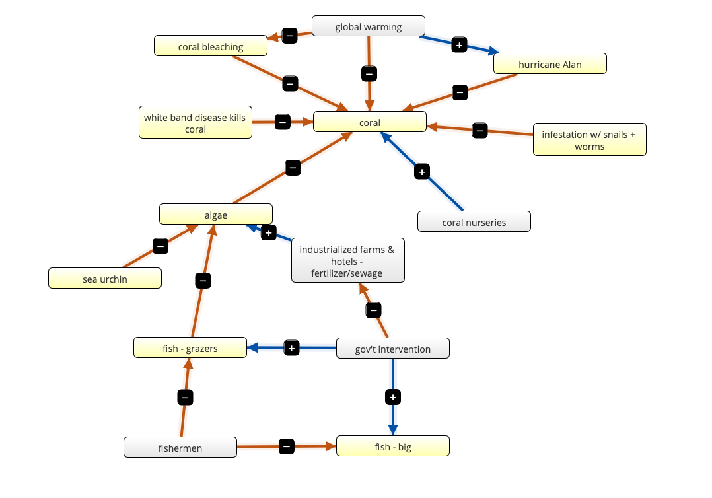
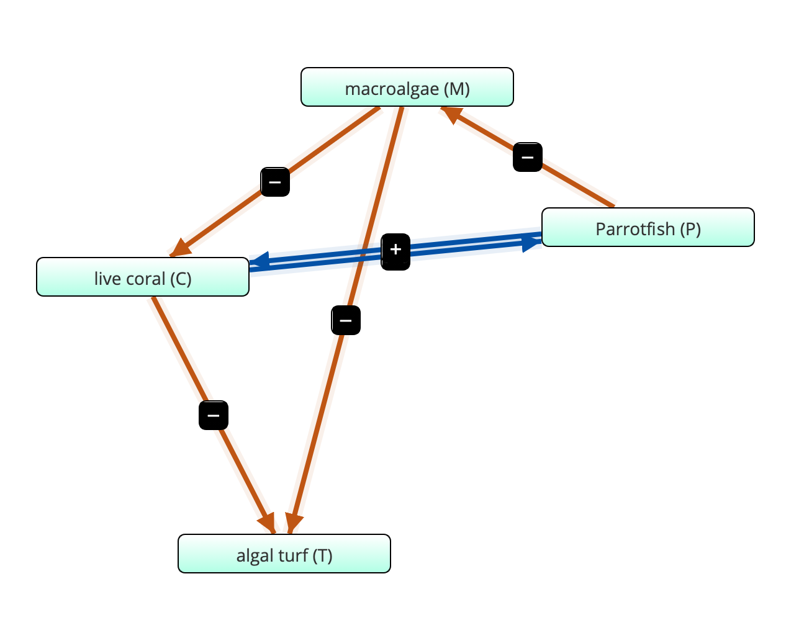

**Part A**
**Our Consensus Flow Diagram**

```{r echo=FALSE}



```
**#3**
**Flow diagram for coral reef system**

```{r echo=FALSE}

```

In this flow diagram, macroalgae grows on top of coral, which is a negative effect for the coral. Coral grows on algal turf, which negatively effects the algal turf. Parrotfish eat the macroalgae, negatively effecting macroalgae. Macroalgae can grow over algal turf, which negatively impacts the algal turf. Parrotfish have an indirect positive effect on coral by eating the algae smothering the coral, and coral has an indirect positive effect on parrotfish by providing a substrate for macroalgae, which parrotfish eat, to grow on. 

```{r echo=FALSE}
read.csv("coral_variables.csv")
```

**# 4: Program the Model**  

  Growth rates for all 4 organisms plotted separately 
  
```{r} 

require(deSolve)
## Loading required package: deSolve

## This first one is for coral. You can change the values as you like and see how coral's growth rate is influenced. I am confused on what 'state' does?

coral_state <- seq(C = .5)
times <- seq(0,100,by=1)

# Parameters
coral_parameters <- c(a = 0.1,g = 0.8, d = 0.44,r = 1, s = 0.49, M = .5, R = .1, C = .01)
coral_paramters <- as.numeric(coral_parameters)


# Model
coral <- function(t,coral_state,coral_parameters){
  with(as.list(c(coral_state,coral_parameters)),{
       dC <- (r*R*C) - (d*C) - (a*M*C)
      list(c(dC))   
  })}

# Solve model and plot results
out1 <- ode(y = coral_state, times=times, func=coral, parms=coral_parameters)
par(mfrow=c(1,1))
coralplot <- plot(out1[,1],out1[,2],ylab='Coral',xlab='time',las=1, pch = 19)

```


``` {r}
### Algal Turf

turf_state <- seq(R = .5)## I think 10 and 50 may be an equilibrium point
times <- seq(0,100,by=1)

# Parameters
turf_parameters <- c(a = 0.1,g = 0.8, d = 0.44,r = 1, s = 0.49, M = .5, P = .5, C = .5, R = .4)

# Model
turf <- function(t,turf_state,turf_parameters){
  with(as.list(c(turf_state,turf_parameters)),{
       dT <- (P*M/(M+R) - (g*M*R) - (r*R*C) + (d*C))
      list(c(dT))   
  })}

# Solve model and plot results
out1 <- ode(y = turf_state, times=times,func= turf, parms=turf_parameters)
par(mfrow=c(1,1))
plot(out1[,1],out1[,2],ylab='Turf',xlab='time',las=1, pch = 19)

```

``` {r}

### Macro algae

macro_state <- seq(M = .5)
times <- seq(0,100,by=1)

# Parameters
macro_parameters <- c(a = 0.1,g = 0.8, d = 0.44,r = 1, s = 0.49, R = .5, P = .5, C = .5, M = .5)

# Model
macro <- function(t,macro_state,macro_parameters){
  with(as.list(c(macro_state,macro_parameters)),{
       dM <- ((a*M*C) - ((P*M)/(M+R)) + (g*M*R))
      list(c(dM))   
  })}

# Solve model and plot results
out1 <- ode(y = macro_state, times=times,func=macro,parms=macro_parameters)
#par(mfrow=c(1,1))
plot(out1[,1],out1[,2],ylab='Macro',xlab='time',las=1, pch = 19)

```

``` {r}

### Parrotfish

parrot_state <- c(P = .5)
times <- seq(0,100,by=1)


# Parameters
parrot_parameters <- c(a = 0.1,g = 0.8, d = 0.44,r = 1, s = 0.49, C = .1)

# Model
parrot <- function(t, parrot_state, parrot_parameters){
  with(as.list(c(parrot_state,parrot_parameters)),{
       dP <- (s*P)*(1- (P/(C)))
      list(c(dP))   
  })}

# Solve model and plot results
out1 <- ode(y = parrot_state, times=times, func=parrot, parms= parrot_parameters)
par(mfrow=c(1,1))
plot(out1[,1],out1[,2],ylab='Parrotfish',xlab='time',las=1, pch = 19)


```

**#5**
#Produce figures and design analyses to address the following questions: 
**(a) What are the long-term dynamics of the system with the default parameters given below?**
  - The long term dynamics are dependent upon the population sizes of macroalgae, algal turf, parrotfish, and coral.

**(b) What are the most important parameters in determining the long-term dynamics?**
  - Coral is one of the most important parameters in determining the long-term dynamics; it influences the growth of every other organism in the system.


``` {r}
### Below, I am trying to make For loops to test our models at different parameters. This first one shows how parrotfish population changes in response to coral population changes.

x <- seq(0,1, by = 0.1) ### variable that changes, in this case, coral.

## Below parameters do not change
s <- as.numeric(s <- 0.49)
a <- as.numeric(a <- 0.1)
g <- as.numeric(g <- 0.8)
d <- as.numeric(d <- 0.44)
r <- as.numeric(r <- 1)

## Below parameters can be changed
M <- as.numeric(M <- 0.5)
C <- as.numeric(C <- 0.5)
P <- as.numeric(P <- 0.5)
R <- as.numeric(R <- 0.8)

## Creating the function

parrot <- function(pop){
       dP <- (s*P)*(1- (P/(x)))
      list(c(dP))   
  }

### The below for loop explores what the parrotfish population 

parrotpop <- c()
for( i in x){
  parrotpop <- parrot(i)
}
print(parrotpop)
 

x <- as.data.frame(x)
parrotpop <- as.data.frame(parrotpop)

parrot_plot <- cbind(x, parrotpop)
plot(parrot_plot, xlab = 'Coral', ylab = 'Parrotfish')  ## as coral increases, so does parrotfish populations


```

```{r}

### For loop for coral populations. You can change the variables by substituting x in for R, C, or M. Note - if you make substitution make sure you also change the name of the x-axis.

x <- seq(0,1, by = 0.1) ### variable that changes, in this case.

## Below parameters do not change
s <- as.numeric(s <- 0.49)
a <- as.numeric(a <- 0.1)
g <- as.numeric(g <- 0.8)
d <- as.numeric(d <- 0.44)

## Below parameters can be changed
M <- as.numeric(M <- 0.5)
C <- as.numeric(C <- 0.5)
P <- as.numeric(P <- 0.5)
R <- as.numeric(R <- 0.8)


# Creating the function
coral <- function(pop){
       dC <- (r*x*C) - (d*C) - (a*M*C)
      list(c(dC))   
  }

# Creating the loop
coralpop <- c()
for( i in x){
  coralpop <- coral(i)
}
print(coralpop)
 
# Making the plot
x <- as.data.frame(x)
coralpop <- as.data.frame(coralpop)

coral_plot <- cbind(x, coralpop)
plot(coral_plot, xlab = 'Algal Turf', ylab = 'Coral')

```

```{r}

### For loop for algal turf populations. You can change the variables by substituting x in for R, C, or M. Note - if you make substitution make sure you also change the name of the x-axis.

x <- seq(0,1, by = 0.1) ### variable that changes, in this case.

## Below parameters do not change
s <- as.numeric(s <- 0.49)
a <- as.numeric(a <- 0.1)
g <- as.numeric(g <- 0.8)
d <- as.numeric(d <- 0.44)
r <- as.numeric(r <- 1)

## Below parameters can be changed
M <- as.numeric(M <- 0.5)
C <- as.numeric(C <- 0.5)
P <- as.numeric(P <- 0.5)
R <- as.numeric(R <- 0.8)


# Creating the function
turf <- function(pop){
       dT <- (x*M/(M+R) - (g*M*R) - (r*R*C) + (d*C))
      list(c(dT))  
  }

# Creating the loop
turfpop <- c()
for( i in x){
  turfpop <- turf(i)
}
print(turfpop)
 
# Making the plot
x <- as.data.frame(x)
turfpop <- as.data.frame(turfpop)

turf_plot <- cbind(x, turfpop)
plot(turf_plot, xlab = 'Parrotfish', ylab = 'Algal Turf')

```

```{r}

### For loop for macroalgae populations. You can change the variables by substituting x in for R, C, or M. Note - if you make substitution make sure you also change the name of the x-axis.

x <- seq(0,1, by = 0.1) ### variable that changes, in this case.

## Below parameters do not change
s <- as.numeric(s <- 0.49)
a <- as.numeric(a <- 0.1)
g <- as.numeric(g <- 0.8)
d <- as.numeric(d <- 0.44)
r <- as.numeric(r <- 1)

## Below parameters can be changed
M <- as.numeric(M <- 0.5)
C <- as.numeric(C <- 0.5)
P <- as.numeric(P <- 0.5)
R <- as.numeric(R <- 0.5)


# Creating the function
macro <- function(pop){
       dM <- ((a*M*x) - ((P*M)/(M+R)) + (g*M*R))
      list(c(dM)) 
  }

# Creating the loop
macropop <- c()
for( i in x){
  macropop <- macro(i)
}
print(macropop)
 
# Making the plot
x <- as.data.frame(x)
macropop <- as.data.frame(macropop)

macro_plot <- cbind(x, turfpop)
plot(turf_plot, xlab = 'Coral', ylab = 'Macroalgae')

```